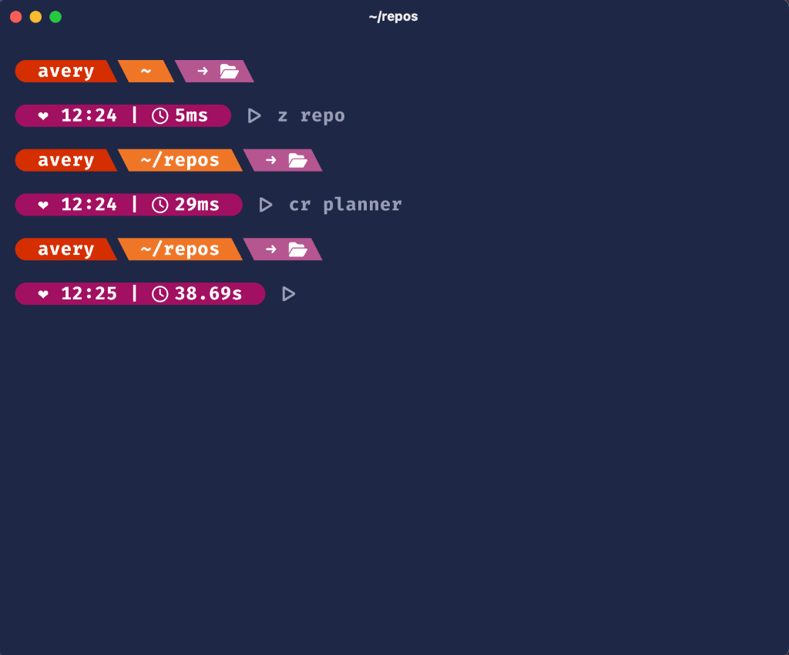
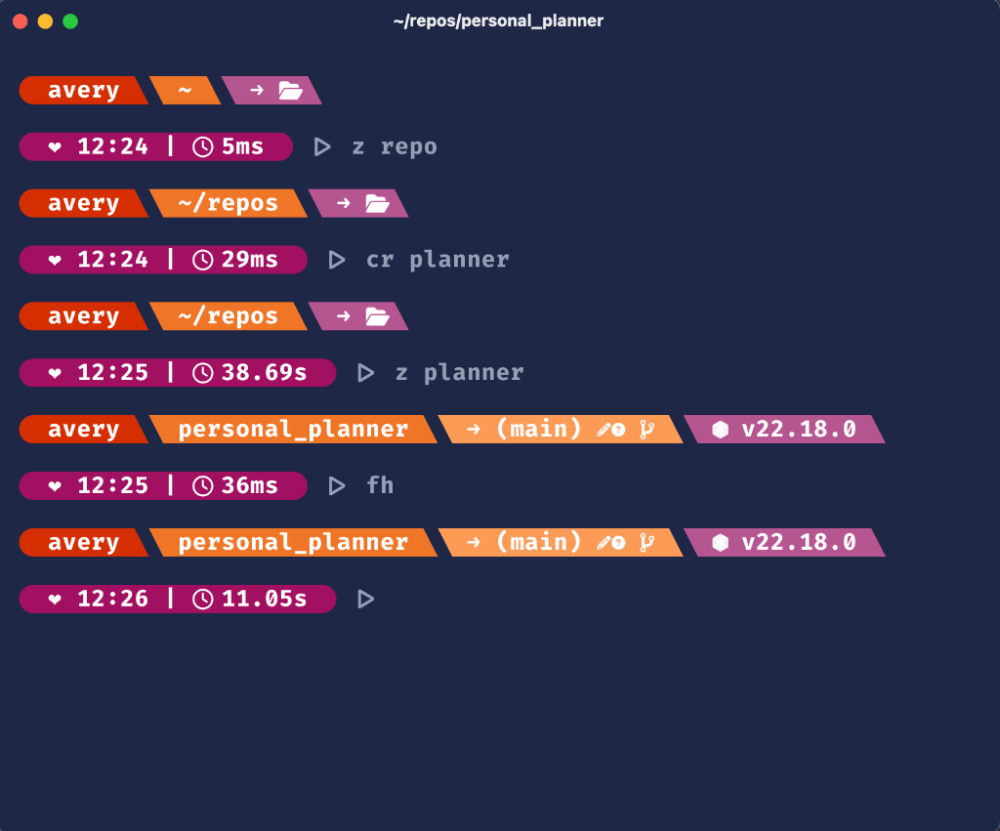
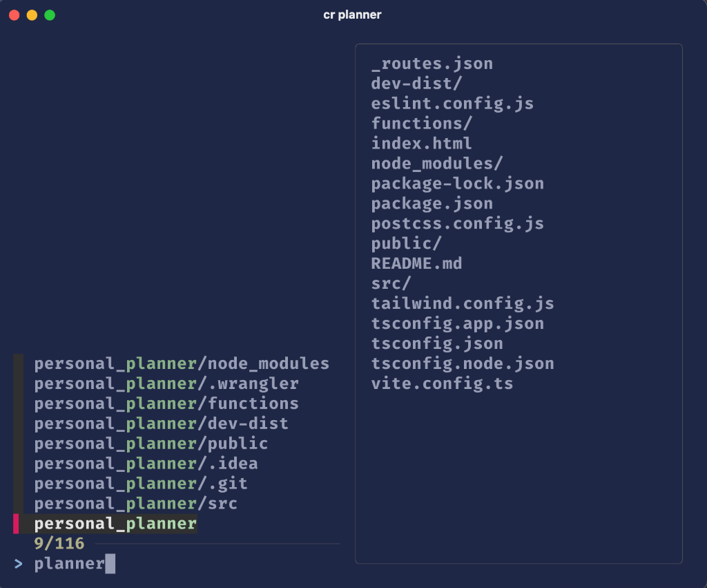
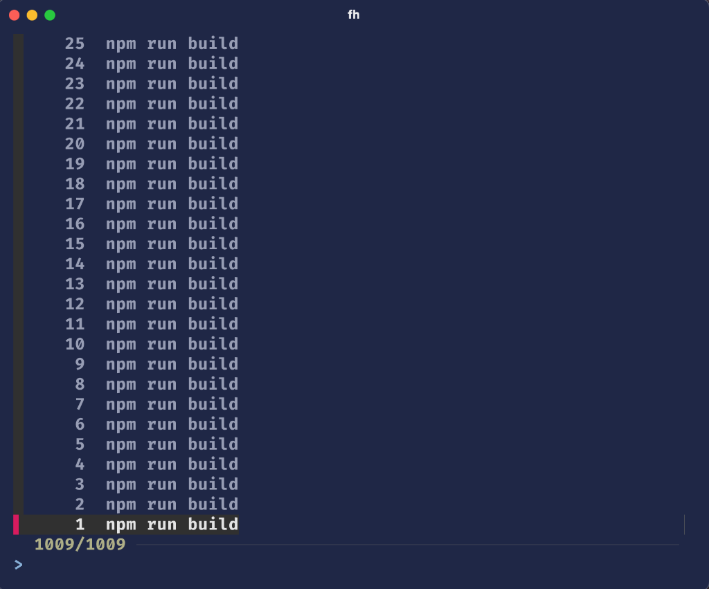

# Avery's Dot Files

A lightweight, modular, and performant ZSH configuration focused on productivity and clear visual feedback without the bloat of frameworks.

## Showcase

````carousel

<!-- slide -->

<!-- slide -->

<!-- slide -->

````

## Overview

This setup provides a highly customized Zsh prompt split into thematic modules. It emphasizes direct control over your shell environment, offering real-time Git status, environment detection, and smart navigation.

## Key Features

### 🚀 Modular Configuration
The configuration is organized into a `zsh/` directory for easy maintenance:
- **[theme.zsh](zsh/theme.zsh)**: Centralized symbols and hand-picked color palette.
- **[git.zsh](zsh/git.zsh)**: Detailed status (staged, dirty, untracked) and ahead/behind tracking.
- **[env.zsh](zsh/env.zsh)**: Smart detection for Node.js, Rust, Python (including VirtualEnvs), Go, and Ruby.
- **[utils.zsh](zsh/utils.zsh)**: Helper functions, path shrinking, and command duration tracking.
- **[nav.zsh](zsh/nav.zsh)**: Fuzzy navigation tools.

### 🔍 Smart Navigation
- **Zoxide Integration**: Uses `z` for jumping to frequent directories based on history.
- **`cr` (CD to Repo)**: Fuzzy search and jump to any repository in `~/repos/` with a live preview.
- **`fh` (Fuzzy History)**: Quickly search and execute commands from your history.

### 📊 Visual Feedback
- **Command Status**: The primary prompt segment turns **Red** on failure.
- **Command Timer**: Shows execution duration for long-running commands (e.g., `| 3s`) inside the main status pill.
- **Path Shrinking**: Automatically contracts deep directory paths (e.g., `~/r/d/z/lib`) to keep your prompt compact.

## Usage

1. **Clone the repository**:
   ```bash
   git clone https://github.com/your-username/dot-files.git ~/repos/dot-files
   ```

2. **Source the configuration**:
   Add the following line to your `~/.zshrc`:
   ```bash
   source ~/repos/dot-files/.prompt-setup
   ```

3. **Requirements**:
   - **[Nerd Fonts](https://www.nerdfonts.com/)**: Required for the icons (e.g., JetBrainsMono Nerd Font).
   - **[fzf](https://github.com/junegunn/fzf)**: Required for fuzzy navigation.
   - **[zoxide](https://github.com/ajeetdsouza/zoxide)**: Optional but recommended for the `z` command.

## Utility Aliases

Included in [.aliases](.aliases) are shortcuts for common Git commands:
- `gs`: git status
- `ga`: git add
- `gc`: git commit -m
- `gp`: git push
- ...and more.

---
*Inspired by the M365 Princess theme, rebuilt for speed and modularity.*
